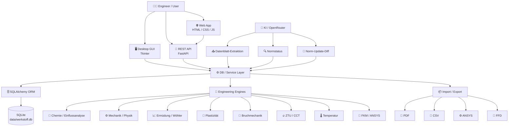

<div align="center">

# 🔩 WerkstoffDB

### Engineering Material Intelligence Platform

**Werkstoffdaten • Normen • Chemie • Kennwerte • Kurven • Bruchmechanik • ZTU/CCT • KI • Exporte**

[](https://www.python.org/)
[](https://fastapi.tiangolo.com/)
[](https://www.sqlalchemy.org/)
[](https://www.sqlite.org/)
[](https://docs.python.org/3/library/tkinter.html)
[](https://matplotlib.org/)
[](https://pytest.org/)
[](#-mehrsprachigkeit)
[](#-ki--und-automatisierung)
[](#-ansys-export)
[](#-ffd--fkm-2002)

</div>

---

## 🎯 Was ist WerkstoffDB?

**WerkstoffDB** ist eine Python-basierte Engineering-Plattform zur strukturierten Verwaltung, Analyse und Bereitstellung technischer Werkstoffdaten.

Sie verbindet eine **Desktop-Anwendung für die Datenpflege** mit einer **FastAPI-Web-App** und einer gemeinsamen SQLite-Datenbank. Neben klassischen Werkstoffkennwerten deckt das Projekt auch technische Spezialgebiete wie **Plastizität, Ermüdung, Bruchmechanik, ZTU/CCT, Normenmanagement und KI-gestützten Datenimport** ab.

> **Engineering first:** Automatisch erzeugte Kurven und KI-extrahierte Werte sind nachvollziehbar zu prüfen. Für sicherheitskritische Nachweise gelten immer die freigegebenen Originalquellen, Messdaten und gültigen Normen.

---

## ✨ Highlights

- 🗄️ **Zentrale Werkstoffdatenbank** mit Revisionen und Quellen
- 🧪 **Chemische Zusammensetzung** inklusive zusätzlicher Elemente
- 📊 **Mechanische, physikalische und dynamische Kennwerte**
- 📈 **Spannungs-Dehnungs- und Wöhlerkurven**
- 🔬 **Plastizität / Hardening** für Engineering-Analysen und ANSYS
- 🩻 **Bruchmechanik** mit Paris, Walker, Forman und NASGRO-Parametern
- 🔥 **ZTU/CCT** mit Ferrit-, Perlit- und Bainit-Kurvenpunkten
- 🌡️ **Temperaturabhängige Kennwerte** und Wärmebehandlung
- 📚 **Normenverwaltung**, Statusprüfung und Update-Diff
- 🤖 **KI-Datenblattimport** aus PDF/TXT
- 📄 **Mehrsprachige PDF-Datenblätter**
- ⚙️ **ANSYS APDL/MAC und Workbench XML**
- 🧩 **FFD/FKM-2002 Export**
- 🌐 **Browser-App** inklusive API
- 🖥️ **Tkinter Desktop-GUI** für die vollständige Datenpflege
- 🌍 **DE / EN / FR / ES**

---

## 🖼️ Screenshots

Die folgenden Ansichten sind aus dem aktuellen Frontend-Design als reproduzierbare README-Ansichten erstellt und zeigen typische Zustände der Anwendung.

### Werkstoffsuche & Übersicht


### Analyse / Wöhlerkurve


---

## 🧩 Modul-Matrix

| Modul | Desktop GUI | Web / API | PDF | Diagramme | Import / Export | KI |
|---|:---:|:---:|:---:|:---:|:---:|:---:|
| Werkstoffe / Stammdaten | ✅ | ✅ | ✅ | — | CSV | — |
| Werkstoffgruppen | ✅ | ✅ | — | — | — | — |
| Chemische Zusammensetzung | ✅ | ✅ | ✅ | — | CSV | ✅ |
| Mechanische Eigenschaften | ✅ | ✅ | ✅ | — | CSV | ✅ |
| Physikalische Eigenschaften | ✅ | ✅ | ✅ | — | CSV | ✅ |
| Dynamische Eigenschaften | ✅ | ✅ | ✅ | 📈 | — | ✅ |
| Spannungs-Dehnung | ✅ | API | ✅ | 📈 | — | — |
| Wöhler / Ermüdung | ✅ | API | ✅ | 📈 | — | — |
| Erweiterte Ermüdung | ✅ | API | — | 📈 | — | — |
| Plastizität | ✅ | API | ✅ | 📈 | ANSYS | — |
| Bruchmechanik | ✅ | API | ✅ | 📈 | — | — |
| NASGRO-Parameter | ✅ | API | — | — | — | — |
| ZTU / CCT | ✅ | API | ✅ | 📈 | — | — |
| Wärmebehandlung | ✅ | API | ✅ | 📈 | — | — |
| Härte | ✅ | API | ✅ | — | — | — |
| Reinheitsgrad | ✅ | API | ✅ | — | — | — |
| Normen | ✅ | ✅ | — | — | PDF | ✅ |
| Norm-Update-Diff | ✅ | — | — | — | PDF | ✅ |
| Norm-Statusprüfung | ✅ | — | — | — | Web | ✅ |
| Dokumente | ✅ | ✅ | — | — | PDF | — |
| PDF-Datenblatt | ✅ | API | ✅ | 📈 | PDF | — |
| ANSYS | ✅ | API | — | — | `.mac` / `.xml` | — |
| FFD / FKM 2002 | ✅ | API | — | — | `.ffd` | — |
| Werkstoffgenerator | ✅ | API | — | 📈 | — | — |
| Einflussanalyse Chemie | ✅ | API | — | — | — | — |

---

## 🏗️ Architektur



### Schichten

```text
┌────────────────────────────────────────────────────────────┐
│ Presentation                                               │
│ Tkinter GUI  •  Web UI  •  REST API  •  PDF               │
├────────────────────────────────────────────────────────────┤
│ Domain / Engineering                                       │
│ Chemie • Mechanik • Dynamik • Plastizität • FKM           │
│ Bruchmechanik • ZTU/CCT • Temperatur • Kurven             │
├────────────────────────────────────────────────────────────┤
│ Services / Data Access                                     │
│ db_service • SQLAlchemy • Pydantic • Migration            │
├────────────────────────────────────────────────────────────┤
│ Persistence                                                │
│ SQLite: data/werkstoff.db                                 │
└────────────────────────────────────────────────────────────┘
```

---

## 📁 Projektstruktur

```text
WerkstoffDB/
│
├── backend/
│   ├── main.py                    # FastAPI Backend
│   ├── models.py                  # SQLAlchemy Modelle
│   ├── schemas.py                 # Pydantic Schemas
│   ├── database.py                # DB-Verbindung
│   ├── migrate.py                 # Migrationen
│   ├── datenblatt_pdf.py          # PDF-Erzeugung
│   ├── norm_status_check.py       # Normstatusprüfung
│   ├── elementwirkung_engine.py   # Chemie-/Wirkungsengine
│   ├── werkstoff_wirkungen.py     # Werkstoffregeln
│   ├── ne_metalle_wirkungen.py    # NE-Metall-Regeln
│   └── i18n.py                     # Backend i18n
│
├── gui/
│   ├── main_window.py             # Hauptfenster
│   ├── werkstoff_editor.py        # Werkstoffeditor
│   ├── eigenschaften_tab.py       # Kennwerte
│   ├── kurven_tab.py              # Kurven
│   ├── kurven_charts.py           # Matplotlib
│   ├── db_service.py              # Datenzugriff
│   ├── ki_import_dialog.py        # KI-Import
│   ├── ki_extraktion.py           # Extraktion
│   ├── norm_check_dialog.py       # Normprüfung
│   ├── norm_update_assistent.py   # Norm-Update
│   ├── csv_import.py              # CSV
│   ├── pdf_export.py              # PDF
│   ├── ansys_export.py            # ANSYS
│   ├── ffd_export.py              # FFD
│   ├── ffd_import.py              # FFD
│   ├── werkstoff_generator.py     # Generator
│   ├── werkstoff_einflussanalyse.py
│   ├── spannungsdehnungs_formeln.py
│   ├── woehler_formeln.py
│   ├── erweiterte_ermuedung_formeln.py
│   ├── plastizitaet_formeln.py
│   ├── bruchmechanik_formeln.py
│   ├── ztu_formeln.py
│   ├── temperatur_kurven.py
│   └── fkm_formeln.py
│
├── frontend/
│   ├── templates/
│   │   ├── index.html
│   │   └── detail.html
│   └── static/
│       ├── css/style.css
│       └── js/
│
├── cli/
│   └── admin.py
│
├── app/tests/                     # pytest
├── data/
│   ├── werkstoff.db
│   ├── sprache_settings.json
│   └── generator_settings.json
│
├── Werkstoffimport/
├── requirements.txt
├── migrate.py
├── schema_diagnose.py
├── gui.bat
├── start.bat
└── server_internet.bat
```

> Hinweis: In der Struktur ist ein Tippfehler nicht gewollt; die tatsächliche Datei heißt `gui/bruchmechanik_formeln.py` und `gui/ztu_formeln.py`.

---

## 🚀 Quick Start

### Voraussetzungen

- Python **3.10+**
- Windows / Linux / macOS grundsätzlich möglich
- Tkinter für die Desktop-GUI
- Internetzugang nur für KI-/Web-Funktionen

### Installation

```powershell
python --version

python -m venv .venv
.venv\Scripts\activate

pip install -r requirements.txt
```

### Datenbank vorbereiten

```powershell
python migrate.py
python schema_diagnose.py
```

### Desktop-GUI

```powershell
python -m gui
```

oder unter Windows:

```text
gui.bat
```

### Web-App

```powershell
python -m uvicorn backend.main:app --reload --port 8000
```

Dann:

```text
http://localhost:8000
```

---

## 🌐 Web-App & REST API

Die FastAPI-Anwendung stellt neben der Browser-Oberfläche eine REST-API bereit.

### API-Dokumentation

```text
http://localhost:8000/docs
http://localhost:8000/redoc
```

### Werkstoffe suchen

```bash
curl "http://localhost:8000/api/werkstoffe?suche=S235"
```

Mit Statusfilter:

```bash
curl "http://localhost:8000/api/werkstoffe?status=aktiv"
```

Mit Werkstoffgruppe:

```bash
curl "http://localhost:8000/api/werkstoffe?gruppe_id=1"
```

### Einzelnen Werkstoff abrufen

```bash
curl "http://localhost:8000/api/werkstoffe/1"
```

### Chemische Elemente abrufen

```bash
curl "http://localhost:8000/api/werkstoffe/1/chem/elemente"
```

### Diagramme als API-Ressource

```text
GET /api/werkstoffe/{id}/sdd-diagramm.png
GET /api/werkstoffe/{id}/woehlerkurve.png
GET /api/werkstoffe/{id}/plast-diagramm.png
GET /api/werkstoffe/{id}/temperatur-diagramme.png
GET /api/werkstoffe/{id}/ermuedung-diagramme.png
GET /api/werkstoffe/{id}/bruchmechanik-diagramm.png
GET /api/werkstoffe/{id}/ztu-diagramm.png
```

### PDF-Datenblatt

```bash
curl -o S235JR.pdf \
  "http://localhost:8000/api/werkstoffe/1/datenblatt.pdf"
```

---

## 🔌 API-Endpunkte – Überblick

| Bereich | GET | POST | PUT | DELETE |
|---|:---:|:---:|:---:|:---:|
| Werkstoffe | ✅ | ✅ | ✅ | ✅ |
| Revisionen | ✅ | ✅ | — | — |
| Normen | ✅ | ✅ | ✅ | ✅ |
| Werkstoffgruppen | ✅ | ✅ | ✅ | ✅ |
| Chemie | ✅ | ✅ | — | ✅ |
| Mechanik | — | ✅ | ✅ | ✅ |
| Physik | — | ✅ | — | ✅ |
| Dynamik | — | ✅ | ✅ | ✅ |
| Plastizität | — | ✅ | ✅ | ✅ |
| Bruchmechanik | — | ✅ | ✅ | ✅ |
| NASGRO | — | ✅ | ✅ | ✅ |
| ZTU / CCT | — | ✅ | ✅ | ✅ |
| Wärmebehandlung | — | ✅ | ✅ | ✅ |
| Härte | — | ✅ | ✅ | ✅ |
| Reinheitsgrad | — | ✅ | ✅ | ✅ |
| Dokumente | — | ✅ | — | ✅ |
| Zusatzsymbole | ✅ | ✅ | ✅ | ✅ |

Die vollständige interaktive Spezifikation ist unter `/docs` verfügbar.

---

## 🤖 KI & Automatisierung

### Datenblatt-Import

```text
PDF / TXT
   ↓
Text- & Tabellenextraktion
   ↓
LLM / strukturierter Prompt
   ↓
Werkstoff-Schema
   ↓
Vorschau & fachliche Prüfung
   ↓
Speichern
```

Die Extraktion berücksichtigt unter anderem:

- Werkstoffname / Kurzname
- Werkstoffnummer
- Normen
- chemische Zusammensetzung
- mechanische Kennwerte
- physikalische Kennwerte
- dynamische Kennwerte
- Wärmebehandlung
- Härte
- Reinheitsgrad
- Bemerkungen und Fußnoten

### Norm-Statusprüfung

Die Anwendung kann hinterlegte Normen auf Aktualität prüfen und Quelleninformationen erfassen.

### Norm-Update-Diff

```text
Neue Norm-PDF
      ↓
Extraktion
      ↓
Vergleich mit DB
      ↓
Änderungs-Diff
      ↓
Benutzer bestätigt
      ↓
Nur bestätigte Änderungen
```

---

## 🧪 Chemie & Einflussanalyse

Die chemische Zusammensetzung kann nicht nur gespeichert, sondern auch für eine **regelbasierte Werkstoff-Einflussanalyse** genutzt werden.

Beispielhafte Tendenzen:

```text
C  ↑  → Festigkeit / Härte ↑
C  ↑  → Schweißbarkeit ↓
Cr ↑  → Korrosionsbeständigkeit ↑
Ni ↑  → Zähigkeit / Austenitstabilität ↑
```

Die Engine soll dabei technische Zusammenhänge erklären und nicht bloß Werte anzeigen.

---

## 📈 Engineering-Analyse

### Spannungs-Dehnung

Berechnung bzw. Darstellung aus hinterlegten Kennwerten, unter anderem:

- E
- Rp0,2
- Rm
- A5
- Temperatur
- Werkstoffzustand

### Wöhler / Ermüdung

Das Projekt enthält eigene Formelfunktionen für Ermüdungs- und Wöhlerauswertungen sowie erweiterte Ermüdungsmodelle.

> Modellierte Kurven sind keine Ersatzdaten für experimentelle Messkurven.

### Plastizität

Unterstützung für echte Kurvendaten und Hardening-Modelle mit Blick auf Engineering- und ANSYS-Workflows.

### Bruchmechanik

Typische Daten:

- `R = Kmin / Kmax`
- `ΔK`
- `da/dN`
- `KIC`
- `JIC`
- `CTOD`
- Temperatur
- Risslänge
- Versuchsnorm

Fit-Modelle:

- Paris
- Walker
- Forman
- NASGRO-Parameterverwaltung

### ZTU / CCT

Unterstützt werden unter anderem:

- Ferrit Start / Ende
- Perlit Start / Ende
- Bainit Start / Ende
- Kühlgeschwindigkeit
- Austenitisierungstemperatur
- ZTU- und CCT-Kurvenpunkte

---

## ⚙️ ANSYS Export

Die Anwendung kann Werkstoffdaten in ANSYS-kompatible Formate übertragen.

```text
WerkstoffDB
   │
   ├──→ ANSYS APDL / MAC
   │
   └──→ ANSYS Workbench XML
```

Insbesondere Plastizitätsdaten können für Hardening-Modelle vorbereitet werden.

---

## 🧩 FFD / FKM 2002

Werkstoffe können als `.ffd` exportiert bzw. importiert werden. Dies unterstützt Workflows für FKM-2002-basierte Betriebsfestigkeitsauswertungen.

---

## 📄 PDF-Datenblatt

Das Datenblatt kann mehrsprachig erzeugt werden und kann unter anderem enthalten:

- Stammdaten
- Normen
- Chemie
- Mechanik
- Physik
- Dynamik
- Wärmebehandlung
- Härte
- Reinheitsgrad
- Bruchmechanik
- ZTU/CCT
- Diagramme
- Quellen / Bemerkungen

Unterstützte Sprachen:

**🇩🇪 Deutsch · 🇬🇧 English · 🇫🇷 Français · 🇪🇸 Español**

---

## 🔢 IDs, Revisionen & Anzeigename

Werkstoffe verwenden eine fortlaufende interne ID:

```text
M00001
M00002
M00003
...
```

Der Anzeigename kann aus dem Kurznamen und gesetzten Zusatzinformationen aufgebaut werden:

```text
S235JR
S235JR+N
S235JR+N+Beschichtung
```

Nur tatsächlich vorhandene Zusatzinformationen werden berücksichtigt.

---

## 🗄️ Datenmodell

Der aktuelle Datenbankbestand enthält u. a. folgende Tabellen:

```text
werkstoffe
werkstoffgruppen
werkstoff_revisionen
werkstoff_alternativen

chem_zusammensetzung
chem_zusatzelemente

mech_eigenschaften
phys_eigenschaften
dynamische_eigenschaften
plast_eigenschaften
bruchmechanik_eigenschaften
nasgro_parameter

umwandlung_kennwerte
ztu_kurvenpunkte
waermebehandlungen
haerte_werte
reinheitsgrade

dokumente
normen
liefernormen
werkstoff_normen
norm_status_pruefungen
zusatzsymbole
```

Aktuell enthält die mitgelieferte Datenbank **14 Werkstoffe, 5 Werkstoffgruppen und 11 Normen**.

---

## 🔄 Migration & Diagnose

Nach Änderungen am Datenmodell:

```powershell
python migrate.py
```

Schema prüfen:

```powershell
python schema_diagnose.py
```

Die Migration ist auf wiederholbare Ausführung ausgelegt; vorhandene Daten sollen nicht unnötig überschrieben werden.

---

## 🧪 Tests

```powershell
pytest
```

oder:

```powershell
pytest app/tests
```

Abgedeckte Bereiche umfassen unter anderem:

- Werkstoffformeln
- Plastizität
- Wöhler / Ermüdung
- ANSYS-Plastizität
- Bruchmechanik
- Spannungs-Dehnung
- FKM
- ZTU
- Temperaturkurven
- Norm-Update-Diff
- API / FFD-Generator

---

## 🔐 Sicherheit

Schreibzugriffe der API können über `WRITE_API_KEY` geschützt werden.

PowerShell:

```powershell
$env:WRITE_API_KEY = "DEIN-GEHEIMER-SCHLUESSEL"
```

Header:

```text
X-API-Key: DEIN-GEHEIMER-SCHLUESSEL
```

Für einen öffentlichen Betrieb sollten zusätzlich TLS, Reverse Proxy, Authentifizierung, Logging und Netzwerkregeln vorgesehen werden.

---

## 🌍 Mehrsprachigkeit

| Sprache | Code |
|---|---|
| 🇩🇪 Deutsch | `de` |
| 🇬🇧 English | `en` |
| 🇫🇷 Français | `fr` |
| 🇪🇸 Español | `es` |

Die Sprachumschaltung wird sowohl im Frontend als auch bei den PDF-Datenblättern berücksichtigt.

---

## 🧭 Roadmap

### Daten

- [ ] Quellenqualität / Vertrauensstufen
- [ ] revisionssicheres Änderungsprotokoll
- [ ] Messdaten vs. Modellwerte explizit unterscheiden
- [ ] stärkere Plausibilitätsprüfung

### Engineering

- [ ] erweiterte Temperatur-/Gefüge-Kopplung
- [ ] mehr Ermüdungsmodelle
- [ ] experimentelle Kurvenverwaltung
- [ ] erweiterte ANSYS-Materialmodelle

### KI

- [ ] semantische Werkstoffsuche
- [ ] automatischer Werkstoffvergleich
- [ ] erklärbare Chemie-Einflussanalyse
- [ ] Quellen- und Unsicherheitsbewertung

### Plattform

- [ ] Benutzer / Rollen
- [ ] Audit-Log
- [ ] Docker Deployment
- [ ] PostgreSQL-Unterstützung für Mehrbenutzerbetrieb

---

## 🧰 Entwicklungsprinzipien

### Reine Engineering-Funktionen

Formelmodule sollen möglichst unabhängig von GUI und Datenbank funktionieren:

```text
                 ┌───────────────┐
                 │ Python Formel │
                 └───────┬───────┘
                         │
           ┌─────────────┼─────────────┐
           ▼             ▼             ▼
         GUI            API           Tests
```

### Keine stillen kritischen Änderungen

Besonders bei KI-Import, Normstatus und Norm-Updates bleibt eine fachliche Kontrolle vorgesehen.

### Quelle vor Komfort

Technische Kennwerte sollten möglichst mit Kontext gespeichert werden:

```text
Wert
+ Einheit
+ Temperatur
+ Zustand
+ Norm
+ Ausgabe
+ Quelle
+ Bemerkung
```

---

## ⚠️ Engineering Disclaimer

WerkstoffDB ist ein **Datenmanagement- und Analysewerkzeug** und ersetzt keine freigegebenen Werkstoffdaten, Laborprüfungen, Normen oder fachliche Freigaben.

Bei sicherheitsrelevanten Anwendungen sind insbesondere:

- gültige Normen
- Original-Datenblätter
- zertifizierte Werkstoffdaten
- Versuchsergebnisse
- projektspezifische Randbedingungen

maßgebend.

---

## 📜 Lizenz

Im aktuellen Projektstand ist keine konkrete Open-Source-Lizenz festgelegt.

Vor einer öffentlichen Veröffentlichung sollte eine `LICENSE`-Datei ergänzt werden.

---

<div align="center">

### 🔩 WerkstoffDB

**Engineering Materials · Standards · Analysis · AI**

</div>
